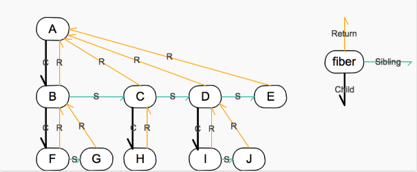

### fiber
```
{
  // Instance
  tag: identifying the type of fiber
  key: unique identifier, React$ElementKey
  elementType: used to preserve the identity during reconciliation
  type: React$ElementType | null
  stateNode: fiber's local state (class instance)

  // Fiber
  return: Fiber | null
  child: Fiber | null;
  sibling: Fiber | null;
  index: number;

  ref: The ref last used to attach this node.

  pendingProps: ?
  memoizedProps: prev props, used to create the output

  updateQueue: A queue of state updates and callbacks
  memoizedState: prev state, used to create the output
  firstContextDependency: ?

  mode: NoContext | ConcurrentMode | StrictMode | ProfileMode;
  // the ConcurrentMode flag indicates whether the subtree should be async by default

  // Effects
  effectTag
  nextEffect: Fiber | null, fast path to the next fiber with side-effects

  firstEffect: the first fiber with side-effect within this subtree
  lastEffect: the last fiber with side-effect within this subtree

  expirationTime: Represents a time in the future by which this work should be completed
  childExpirationTime: This is used to quickly determine if a subtree has no pending changes

  alternate: Fiber | null, used for double buffering pooling technique
}
```


### [createFiber](https://github.com/facebook/react/blob/v16.6.3/packages/react-reconciler/src/ReactFiber.js#L287)
`FiberNode` will create a `fiber` with default value, except for the arguments
```
In
  tag: WorkTag
  pendingProps: mixed
  key: null | string
  mode: TypeOfMode
Out
  new FiberNode(tag, pendingProps, key, mode);
```

### [createFiberFromTypeAndProps](https://github.com/facebook/react/blob/v16.6.3/packages/react-reconciler/src/ReactFiber.js#L414)
```
In
  type: any, // React$ElementType
  key: null | string,
  pendingProps: any,
  owner: null | Fiber,
  mode: TypeOfMode,
  expirationTime: ExpirationTime,
Body
  let resolvedType = type;
  fiberTag = IndeterminateComponent; // Before we know whether it is function or class
  if_is_class_component
    fiberTag = ClassComponent
  if_is_dom_component
    fiberTag = HostComponent // real dom element
  switch(type)  <<<<<--------------------------------------------------------------------
    REACT_FRAGMENT_TYPE:        > createFiberFromFragment(...)     // <></>             |
    REACT_CONCURRENT_MODE_TYPE: > createFiberFromMode(...)  // ?                        |
    REACT_STRICT_MODE_TYPE:     > createFiberFromMode(...)      // ?                    |
    REACT_PROFILER_TYPE:        > createFiberFromProfiler(...)     // ?                 |
    REACT_SUSPENSE_TYPE:        > createFiberFromSuspense(...)     // <Suspense>        |
    switch(type.$$typeof)                                                               |
      REACT_PROVIDER_TYPE: fiberTag = ContextProvider;  // context provider             |
      REACT_CONTEXT_TYPE: fiberTag = ContextConsumer;   // context consumer             |
      REACT_FORWARD_REF_TYPE: fiberTag = ForwardRef;    // React.forwardRef             |
      REACT_MEMO_TYPE: fiberTag = MemoComponent;        // React.memo()                 |
      REACT_LAZY_TYPE: fiberTag = LazyComponent;        // React.lazy()                 |
      back_to ---------------------------------------------------------------------------

  fiber = createFiber(fiberTag, pendingProps, key, mode);
  fiber.elementType = type;
  fiber.type = resolvedType;
  fiber.expirationTime = expirationTime;
Out
  fiber
```

### [createWorkInProgress](https://github.com/facebook/react/blob/v16.6.3/packages/react-reconciler/src/ReactFiber.js#L326)
> The alternate of the current fiber is the `work-in-progress`, and the alternate of the `work-in-progress` is the current fiber.

this function is used to create an `alternate` fiber to do work on.
```
In
  current: Fiber
  pendingProps: any
  expirationTime: ExpirationTime
Body
  workInProgress = current.alternate
  if_workInProgress_exist
    workInProgress.pendingProps = pendingProps;
    reset_effect_properties_in_workInProgress
    reuse_rest_properties_in_current
  else
    // reuse most properties in current fiber except for pendingProps
    workInProgress = createFiber(...)
    workInProgress.elementType = current.elementType;
    workInProgress.type = current.type;
    workInProgress.stateNode = current.stateNode;

    workInProgress.alternate = current;
    current.alternate = workInProgress;

Out
  workInProgress
```